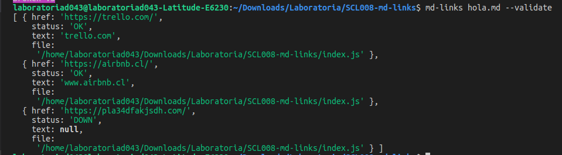

# Markdown Links - md-links 

[Markdown](https://es.wikipedia.org/wiki/Markdown) es un lenguaje de marcado
ligero muy popular entre developers. Es usado en muchísimas plataformas que
manejan texto plano (GitHub, foros, blogs, ...), y es muy común
encontrar varios archivos en ese formato en cualquier tipo de repositorio
(empezando por el tradicional `README.md`).

Estos archivos `Markdown` normalmente contienen _links_ (vínculos/ligas) que
muchas veces están rotos o ya no son válidos y eso perjudica mucho el valor de
la información que se quiere compartir.

Por eso he creado una herramienta usando [Node.js](https://nodejs.org/), que lea 
y analice archivos en formato `Markdown`, para verificar los links que contengan y reportar
algunas estadísticas, como si los links están caídos o funcionan.

## Instalación
**CLI**: sudo npm install -g md-links-ale

**In-browser**: npm install md-links-ale

## Usabilidad y ejempĺos

const mdLinks = require ('md-links-ale')

**CLI**: md-links README.md 

retornaría los links de esta forma:

`[ {'https://es.someExample.org/wiki/example',
  'https://nodejs.org/',
  'https://anotherExample.com/invite/b/exampleLink'} ]`

**CLI**: md-links README.md --validate

retornaría los links de esta forma:

`[ {'https://es.someExample.org/wiki/example' status: DOWN,
  'https://nodejs.org/ status: OK',
  'https://anotherExample.com/invite/b/exampleLink' status: DOWN} ]`

  **CLI**: md-links README.md --stats

retornaría:

## Planificación 

Para el board con el backlog para la implementación de la librería, utilicé:
[Trello](https://trello.com/invite/b/5AGTMBps/51d6b63b1150b2b346c6c02c0ee6e4a1/markdown)
y [Milestones](https://github.com/aleisabl/SCL008-md-links/milestones) e [Issues](https://github.com/aleisabl/SCL008-md-links/issues) presentadas en Github.
